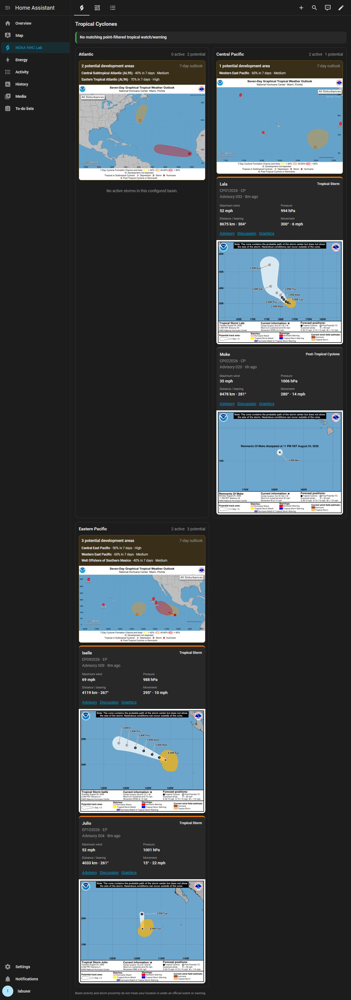
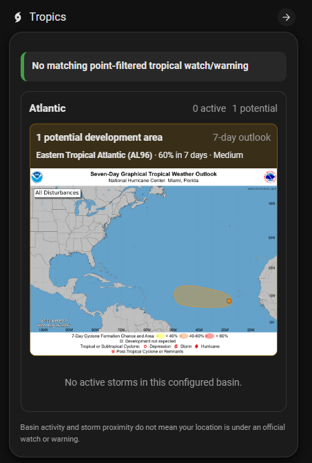
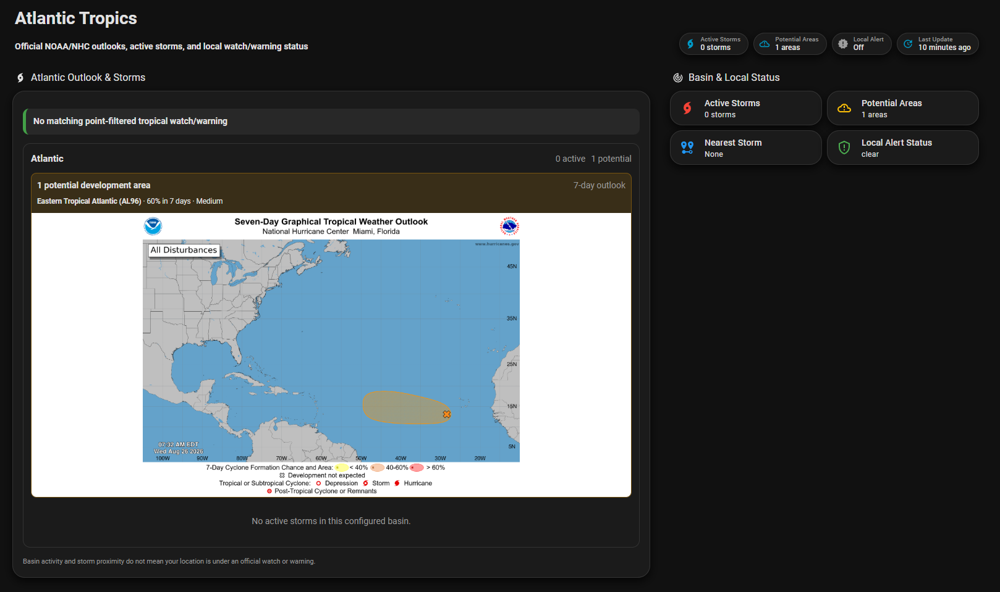

# NOAA NHC Card

[](https://github.com/rellerton/lovelace-noaa-nhc-card/actions/workflows/validate.yml)
[](https://github.com/rellerton/lovelace-noaa-nhc-card/actions/workflows/hacs.yml)
[](LICENSE)

An optional dynamic Lovelace card for the
[NOAA NHC Sensor Suite](https://github.com/rellerton/noaa-nhc-sensor-suite)
Home Assistant custom integration. It renders selected basins, development
outlooks, every active official storm, cached official graphics, source
freshness, and authoritative point-filtered local tropical alerts without
hard-coded entity IDs.

> [!WARNING]
> This is an unofficial community project. It is not affiliated with, endorsed
> by, or operated by NOAA, NHC, CPHC, NWS, or the United States government. Do
> not use Home Assistant or this card for life-safety decisions. Always consult
> official forecasts and instructions from local authorities.

## Why this card and integration?

There are already many hurricane dashboards, cards, and NOAA integrations in
the Home Assistant community. The companion projects were created with that
ecosystem in mind, including projects such as `unclvito/nhc`,
`dawg-io/noaa_it_all`, and `aaronmayeux/ha-hurricane-tracker`.

The goal here is not to claim the first hurricane integration. It is to provide
an independently implemented, comprehensive and tested combination: a backend
that can select any set of NHC basins and expose automation-friendly entities,
plus an optional card that can filter those basins again per dashboard and
automatically follow storms as they form or dissipate. The card never depends
on temporary NHC slots or user-renamable Home Assistant entity IDs.

## Requirements

- [NOAA NHC Sensor Suite](https://github.com/rellerton/noaa-nhc-sensor-suite)
  `0.3.3` or newer
- presentation contract version `1`
- a modern Home Assistant frontend

The sensor integration is fully functional without this card.

## Screenshots

### All configured basins



### Mobile Atlantic card

This is a normal masonry card, not a panel-only dashboard:



### Atlantic dashboard example

The same card can be combined with ordinary Home Assistant cards and entities:



The graphics in these screenshots are official NHC products displayed through
the integration's authenticated cache. NOAA/NHC branding is not used as this
project's branding; it appears only inside screenshots of official products.

## Installation with HACS

Install the backend integration first, then add this card as a HACS custom
repository:

1. Open HACS in Home Assistant.
2. Open the three-dot menu and select **Custom repositories**.
3. Add `https://github.com/rellerton/lovelace-noaa-nhc-card` with category
   **Dashboard**.
4. Search for **NOAA NHC Card** and download it.
5. Refresh the browser. If HACS asks for a restart, restart Home Assistant.
6. Add `custom:noaa-nhc-card` to a dashboard using the card YAML examples below.

[](https://my.home-assistant.io/redirect/hacs_repository/?owner=rellerton&repository=lovelace-noaa-nhc-card&category=plugin)

HACS normally registers `/hacsfiles/lovelace-noaa-nhc-card/noaa-nhc-card.js` as
a JavaScript module. If it does not, add that URL manually under dashboard
resources.

### Manual installation

Copy `dist/noaa-nhc-card.js` to `/config/www/noaa-nhc-card.js`, then register
`/local/noaa-nhc-card.js` as a JavaScript module in dashboard resources. Refresh
the browser before adding the card.

## Basic configuration

Show every basin selected in the integration:

```yaml
type: custom:noaa-nhc-card
title: Tropical Cyclones
```

Show only Atlantic while the integration continues collecting other basins:

```yaml
type: custom:noaa-nhc-card
title: Atlantic Basin
basins:
  - al
wind_speed_unit: mph
storm_image_position: bottom
```

Show a combined Pacific card:

```yaml
type: custom:noaa-nhc-card
title: Pacific Basins
basins:
  - ep
  - cp
show_local_alerts: false
show_outlook_images: true
```

## Complete configuration reference

The card is currently configured through Lovelace YAML/code editor.

| Option | Type | Default | Description |
| --- | --- | --- | --- |
| `type` | string | required | Must be `custom:noaa-nhc-card`. |
| `title` | string | `Tropical Cyclones` | Card heading. |
| `basins` | list | all integration-selected basins | Non-empty subset of `al`, `ep`, and `cp`. |
| `show_images` | boolean | `true` | Show the selected official per-storm graphic when available. |
| `show_outlook_images` | boolean | `true` | Show official seven-day basin outlook graphics, including when the current outlook has zero potential areas. |
| `show_local_alerts` | boolean | `true` | Show point-filtered local tropical alert status above basin sections. |
| `storm_image_position` | string | `bottom` | Place storm graphics at `top` or `bottom` of each storm sub-card. |
| `wind_speed_unit` | string | `knots` | Display maximum sustained wind as `knots` or `mph`. This does not alter backend sensor units. |
| `refresh_seconds` | integer | `60` | Presentation refresh interval; values below 15 seconds are clamped to 15. |

Full example:

```yaml
type: custom:noaa-nhc-card
title: Tropical Cyclones
basins:
  - al
  - ep
  - cp
show_images: true
show_outlook_images: true
show_local_alerts: true
storm_image_position: bottom
wind_speed_unit: knots
refresh_seconds: 60
```

## What the card displays

For every visible basin:

- active-storm count and explicit quiet state;
- official seven-day potential-development count;
- compact location, probability, and risk summaries;
- source freshness/staleness; and
- optional authenticated official outlook imagery that opens the corresponding
  NHC outlook page when clicked.

For every active storm in those basins:

- official storm ID, name, and classification with severity styling;
- advisory number and age;
- maximum sustained wind and central pressure;
- distance and bearing from the integration's configured reference location;
- movement direction and speed;
- official public advisory, discussion, and graphics links; and
- optional cached official cone/watch-warning/wind-field graphic that opens
  the storm's current NHC graphics page when clicked.

The card separately labels basin activity, geographic proximity, and an
official alert affecting the reference point. A basin with a storm or outlook
area does not imply that the configured location is under a warning.

## Dynamic discovery and privacy

The card calls the authenticated `noaa_nhc/presentation` WebSocket command. The
versioned bounded contract supplies stable official storm IDs, basin summaries,
compact normalized metadata, freshness, local alerts, official links, and
short-lived signed image URLs.

The card does not search the entity registry and does not depend on entity IDs.
The contract omits private coordinates, raw CurrentStorms/GIS/NWS payloads, and
image bytes. Upstream text is escaped and outgoing URLs are validated before
rendering.

## Layout behavior

This is a normal Lovelace card. It works in masonry, sections, panel, and other
compatible dashboard layouts. The internal basin grid uses one column on narrow
screens and as many columns as fit on wider cards. Each basin outlook and each
storm is grouped in its own sub-card.

If an optional image fails, only that image is removed; the basin or storm facts
remain visible. Stale last-good data is labeled rather than silently presented
as current.

## Troubleshooting

- **Custom element does not exist:** confirm HACS installed the repository,
  verify the JavaScript resource, then hard-refresh the browser.
- **NOAA NHC is not loaded:** install and configure the backend integration
  before using the card.
- **Unsupported presentation contract:** update both repositories so their
  compatibility versions match.
- **A selected basin is missing:** make sure the integration itself is
  configured for that basin. Card filters cannot add a basin the backend did not
  fetch.
- **An image is absent:** the selected official product may not exist for that
  storm/advisory, or the source may be temporarily unavailable. The storm data
  remains visible.
- **Local alert says clear while storms are active:** that is expected when no
  matching NWS alert affects the configured reference point.

## Removal

Remove every `custom:noaa-nhc-card` instance from dashboards, remove its resource
if it was added manually, then uninstall the repository through HACS. Removing
the card does not remove or disable the backend integration.

## Development

```powershell
npm ci
npm run check
npm test
npm run build
```

The reproducible Vite build writes the minified `dist/noaa-nhc-card.js` without
a source map. Tests cover dynamic basin/storm rendering, basin filtering,
missing imagery/links, local alerts, source staleness, wind-unit conversion,
image position, contract compatibility, and unsafe URL/string handling.

## License

[MIT](LICENSE)
